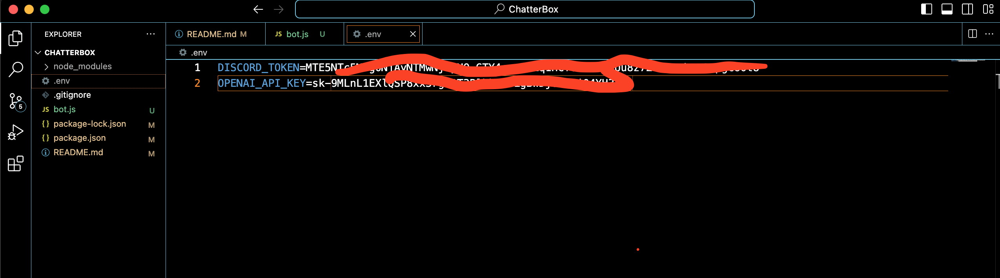
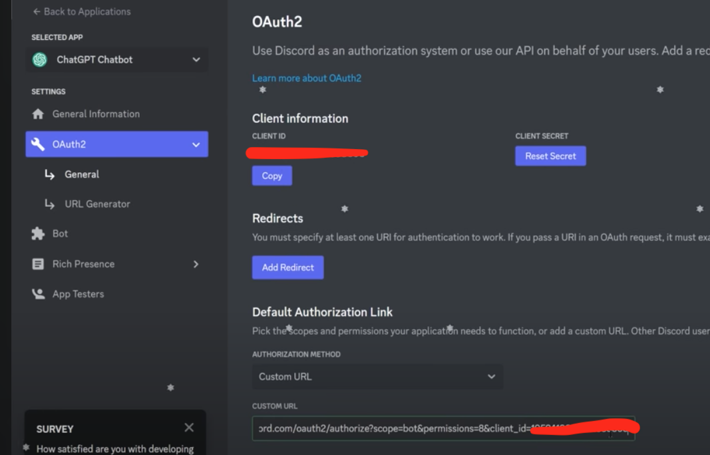
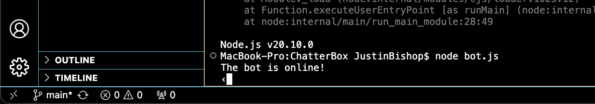
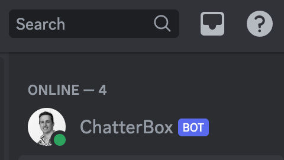

##ChatterBox

need these dependencies
node
dotenv
discord.js
openai

npm init -y  
npm install dotenv discord.js openai.  

First you need an OPENAI API key. Go to your OPENAI account and get your API key and place it in your .env file.  

The part of this project that is not code involves building the bot setup on discord.  

Go to Discord.com/developers/applications and set your bot permissions.  

Then use their Auth2 tab to take your client ID and input it into the end of this string.  

https://discord.com/oauth2/authorize?scope=bot&permissions=8&client_id=YOURCLIENTID_HERE  

Once you see a popup with you logged in. You can see your servers that you want to add the bot to.  

Put your Discord bot token into your .env file. You should have your own API keys.  

then run 'node bot.js' in the directory to get the bot online.  

Then go in discord and you will see the bot online.  

type '/' then your question to talk to bot. ex "/what is the weather today bro?"

You should see 'typing' and then like magic the bot will respond.

Congratz you just made your first bot!

You can contact me justinb.developer@gmail.com if you need help.

Justin Bishop
